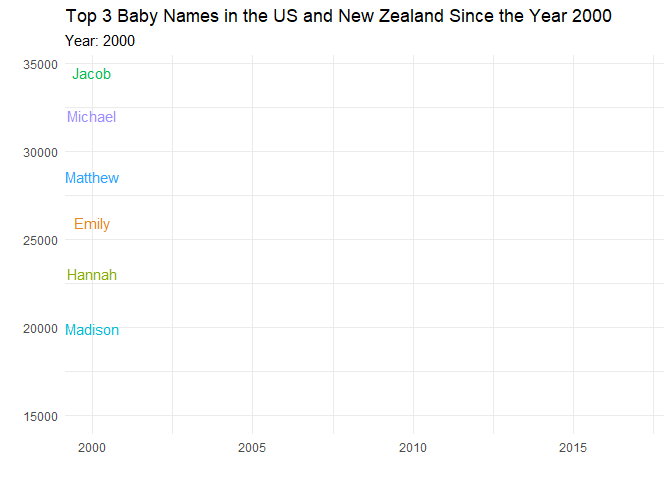

```{r setup, include=FALSE}
knitr::opts_chunk$set(echo = TRUE, error=TRUE, message=FALSE, warning=FALSE)
```

```{r libraries}
library(tidyverse)     # for graphing and data cleaning
library(lubridate)     # for date manipulation
library(ggthemes)      # for even more plotting themes
library(maps)          # for map data
library(ggmap)         # for mapping points on maps
library(gplots)        # for col2hex() function
library(RColorBrewer)  # for color palettes
library(sf)            # for working with spatial data
library(leaflet)       # for highly customizable mapping
library(ggthemes)      # for more themes (including theme_map())
library(plotly)        # for the ggplotly() - basic interactivity
library(gganimate)     # for adding animation layers to ggplots
library(gifski)        # for creating the gif (don't need to load this library every time,but need it installed)
library(transformr)    # for "tweening" (gganimate)
library(shiny)    
theme_set(theme_minimal()) # My favorite ggplot() theme :)
```

## Data choice 1: Baby Names

```{r}
# Read in the data

# Or read in the data manually

babynames <- readr::read_csv('https://raw.githubusercontent.com/rfordatascience/tidytuesday/master/data/2022/2022-03-22/babynames.csv')


# If the code above gives an error, uncomment the code below and use it instead. 
# You will need to install the tidytuesdayR package first.

# library(tidytuesdayR)
# 
# tuesdata <- tidytuesdayR::tt_load('2022-03-22')
# tuesdata <- tidytuesdayR::tt_load(2022, week = 12)
# 
# babynames <- tuesdata$babynames
```

This week's data should be familiar from previous exercises. There is data for both babynames from New Zealand and the US. Read more about it, including definitions of variables, [here](https://github.com/rfordatascience/tidytuesday/blob/master/data/2022/2022-03-22/readme.md). 

```{r}
new_babies <- babynames %>% 
  filter(year >= 2000) %>% 
  group_by(year, sex) %>% 
  arrange(desc(n)) %>% 
  slice_head(n = 3)
  
  
```


```{r, fig.alt = "This gif shows the top 3 baby names from the baby names dataset collected from the US and New Zealand since the year 2000 onward. It shows the names Jacob, Michael, Matthew, Joshua, Hannah, Emily, Madison, Isabella, Ethan, Sophia, Olivia, William, Mason, Noah, Ava, Liam, and Emma starting high and then decreasing overtime in general."}

bouncing_babies_gganim <- new_babies %>% 
  ggplot(aes(x = year, 
             y = n,
             color = name)) +
  geom_line() +
  geom_text(aes(label = name)) +
  labs(title = "Top 3 Baby Names in the US and New Zealand Since the Year 2000",
       subtitle = "Year: {frame_along}",
       x = "",
       y = "",
       color = "Name") +
  
  theme(legend.position = "none") + 
  transition_reveal(as.integer(year))



```

```{r}
animate(bouncing_babies_gganim, fps = 4)
anim_save("2000s_babies.gif")


```


Take a minute to plan out on paper or the white board what you want your plot to look like and then dive into the code. And make sure to read about what the variables are first! 

When you are finished, please delete all the unneeded code and instructions and uncomment (delete the `#`) in the options section of code at the top. If you feel up for it, we encourage you to tweet out your graph with the `#TidyTuesday` hashtag and tag `@lisalendway` (Prof. Lisa) and `@Sintripetal` (Prof. Lauren). See the Tidy Tuesday description file if you want to use our `@MacTidyTuesday` Twitter account to do that. PLEASE take a moment to read the message at the top about alt text. If you want to post on Twitter, be sure to add that. If you need help, ask. Also, consider adding a caption or tag label with your name and source of the dataset. You can do this by adding something like: `labs(caption = "Plot created by YOURNAME, data from DATASOURCE")` to your plot code.

